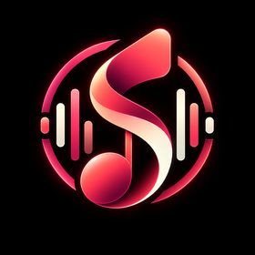

<div align="center">



# Sonaris

### Your music. Your server. Your sound.

**A modern self-hosted music platform built on Navidrome, designed to bring a polished streaming experience to your own music library.**

[](LICENSE)
[](#project-status)
[](https://github.com/navidrome/navidrome)

</div>

---

## What is Sonaris?

Sonaris is a self-hosted music server and streaming interface for people who want full control over their music library without giving up the polished experience of a modern commercial streaming service.

The project is based on [Navidrome](https://github.com/navidrome/navidrome) and keeps its proven music-server foundation while building a distinct Sonaris experience on top: a redesigned interface, a new player, discovery features, mixes, radio, richer library views, listening statistics, device handoff, social features and more.

Sonaris is intended to feel familiar to users of modern music streaming apps while remaining fully self-hosted and focused on music you own and control.

> [!IMPORTANT]
> Sonaris is currently in **pre-alpha development**. The project is not yet intended to replace a stable Navidrome installation.

---

## Vision

Sonaris aims to become a complete personal music platform with four core principles:

- **Beautiful by default** — a polished dark interface with a visual identity based on the Sonaris logo palette.
- **Your library first** — your files, your metadata, your server and your listening history remain under your control.
- **Modern discovery** — recommendations, mixes, radio and rediscovery features should make large personal libraries feel alive.
- **Keep the strong foundation** — retain Navidrome's mature scanner, database, transcoding and OpenSubsonic compatibility wherever possible.

Sonaris takes interaction inspiration from leading music apps, but it is not intended to copy proprietary branding, assets or source code. Sonaris has its own visual language and identity.

---

## Project Status

Sonaris is currently in the **foundation and rebranding stage**.

The immediate goal is to establish a clean Sonaris layer above the Navidrome core before larger product features are introduced. Internal Navidrome-compatible configuration, APIs and package structure will initially remain unchanged where changing them would provide little user benefit or create unnecessary upstream conflicts.

### Current foundation

Thanks to the Navidrome core, the project already has a strong technical base for:

- large local music libraries
- metadata scanning and library monitoring
- multi-user accounts
- playlists and favourites
- playback history and play counts
- many audio formats
- on-the-fly transcoding
- lyrics support
- responsive web playback
- OpenSubsonic / Subsonic-compatible clients
- low-resource self-hosted operation

### Sonaris-specific work

The Sonaris layer will progressively add:

- complete Sonaris branding
- a new design system based on the Sonaris logo colors
- redesigned navigation and home experience
- a new persistent player and queue
- richer album, artist and library pages
- universal search
- visual smart-playlist creation
- personalized mixes and radio
- listening insights and yearly Rewind
- device handoff / Sonaris Connect
- optional social features for multi-user servers
- audio analysis and advanced discovery
- dedicated desktop/mobile experiences

---

## Design Language

Sonaris uses a dark-first visual language built around the colors of the official Sonaris logo.

### Initial logo-derived palette

| Role | Color |
| --- | --- |
| Background | `#000000` |
| Sonaris Pink | `#F8425A` |
| Sonaris Coral | `#F97773` |
| Sonaris Crimson | `#CE1F49` |
| Sonaris Deep Red | `#8C1033` |
| Sonaris Cream | `#F9EEDA` |

These values are the initial design palette sampled from the current logo and may be fine-tuned when the full design system is implemented.

The design system will use reusable tokens instead of hard-coded component colors:

```css
--sonaris-primary;
--sonaris-primary-light;
--sonaris-primary-dark;
--sonaris-accent;
--sonaris-accent-hover;

--sonaris-background;
--sonaris-surface;
--sonaris-surface-raised;
--sonaris-border;

--sonaris-text;
--sonaris-text-secondary;
```

The intended visual direction combines near-black backgrounds, coral/pink gradients, cream highlights, subtle glow, large album artwork, clean typography, soft elevated surfaces and smooth playback transitions.

---

## Planned Navigation

```text
SONARIS

Home
Search

YOUR MUSIC
Liked Songs
Albums
Artists
Songs
Genres

DISCOVER
Made for You
Radio
Discover

YOUR LIBRARY
Playlists
History
Downloads

--------------------
Now Playing / Queue
```

---

## Player Experience

The Sonaris player is planned as a permanent, first-class part of the interface rather than a secondary control strip.

### Core playback

- play / pause
- previous / next
- seek bar
- volume and mute
- shuffle
- repeat queue / repeat track
- queue management
- favourite / like
- track context menus
- album and artist navigation
- playback time and remaining time

### Advanced playback

- gapless playback
- configurable crossfade
- ReplayGain
- per-player audio quality
- direct-play / transcode status
- lossless and Hi-Res information
- output device selection
- synchronized queue state

A Sonaris-specific playback detail will be clear technical quality information, for example:

```text
FLAC · 24-bit · 96 kHz · Direct Play
```

or:

```text
FLAC → Opus · 192 kbps · Transcoding
```

---

## Architecture

The goal is to create a distinct product without needlessly replacing reliable parts of Navidrome.

```text
                 SONARIS

        +-----------------------+
        |     Sonaris Web UI    |
        |  New UX and branding  |
        +-----------------------+
        |   Sonaris Features    |
        | Mixes / Radio / Social|
        +-----------------------+
        |     Navidrome Core    |
        | Scanner / DB / Users  |
        +-----------------------+
        | OpenSubsonic API      |
        +-----------------------+
        | FFmpeg / File Library |
        +-----------------------+
```

### Compatibility strategy

During the early releases Sonaris intentionally keeps compatibility-sensitive internals such as:

- `ND_*` configuration variables
- existing database structures unless migrations are required
- OpenSubsonic / Subsonic API compatibility
- internal Go module/package paths where renaming would create large upstream conflicts

This lets Sonaris continue receiving useful upstream fixes while the visible product evolves independently.

---

## Technology Stack

The current Sonaris fork uses:

- **Go 1.27** for the server
- **Node.js 24** for frontend tooling
- **React** for the web interface
- **Material UI** in the current inherited frontend
- **Vite** for frontend development/build tooling
- **SQLite** by default for application data
- **FFmpeg** for transcoding and media processing
- **OpenSubsonic / Subsonic APIs** for compatible clients

The frontend architecture and component library may evolve as the Sonaris UI is rebuilt.

---

## Development Setup

### Requirements

- Go 1.27
- Node.js 24
- npm
- Make
- Git
- FFmpeg

### Clone

```bash
git clone https://github.com/Homiiboy/Sonaris.git
cd Sonaris
```

### Install development dependencies

```bash
make setup
```

### Start the development environment

```bash
make dev
```

The development server uses port **4533** by default.

```text
http://localhost:4533
```

### Tests

```bash
make test
make test-js
make testall
```

### Lint and format

```bash
make lintall
make format
```

> [!NOTE]
> Production-ready Sonaris packages and Sonaris-branded Docker images are planned for a later milestone. Until then, this repository should be treated as a development source tree.

---

# Roadmap

The roadmap is intentionally staged. User-facing foundations come first; recommendation, social and multi-device features follow after the core experience is stable.

## 0.1 — Fork Foundation & Branding

**Goal:** Establish Sonaris as a distinct project while preserving upstream compatibility.

- replace visible Navidrome naming with Sonaris
- Sonaris README and project documentation
- browser title and metadata
- PWA name and metadata
- Sonaris favicon and app icons
- login branding
- loading / splash branding
- keep GPL-3.0 licensing and upstream attribution
- establish a clean upstream-sync workflow
- avoid unnecessary API/config/database renames

**Status:** In progress

---

## 0.2 — Sonaris Design System

**Goal:** Remove the inherited Navidrome visual identity and define the permanent Sonaris style.

- official Sonaris logo integration
- exact logo-derived color palette
- dark-first theme
- Sonaris design tokens
- typography scale
- spacing and radius system
- cards, buttons, menus and dialogs
- hover, focus and active states
- subtle gradient/glow language
- responsive component standards
- accessibility and keyboard-focus rules

---

## 0.3 — Sonaris Player

**Goal:** Build a premium persistent playback experience.

- redesigned bottom player
- queue panel
- artwork and track information
- play / pause / seek / volume
- shuffle and repeat
- favourites
- gapless playback
- crossfade settings
- ReplayGain controls
- playback quality selector
- Direct Play / Transcoding indicator
- codec, bitrate, sample rate and bit-depth display
- fullscreen Now Playing experience

---

## 0.4 — Home Experience

**Goal:** Replace the traditional library landing page with a personalized streaming-style home.

Planned sections include:

- Good morning / afternoon / evening greeting
- Recently Played
- Jump Back In
- Made for You
- Recently Added
- Favourite Albums
- Heavy Rotation
- Because You Listened To…
- Rediscover
- Popular in Your Library

---

## 0.5 — Library 2.0

**Goal:** Make very large personal libraries fast and pleasant to browse.

- Songs, Albums, Artists and Genres
- grid / compact grid / list modes
- richer artist pages
- richer album pages
- Liked Songs
- sort by title, artist, album, year and date added
- filter by format, quality and playback state
- Recently Added / Recently Played
- Never Played
- Most Played
- Lossless
- Hi-Res

---

## 0.6 — Universal Search

**Goal:** Make everything discoverable from one search surface.

- instant search while typing
- top result
- songs
- artists
- albums
- playlists
- genres
- fuzzy matching
- keyboard navigation
- recent searches
- search suggestions
- optional advanced filters

---

## 0.7 — Playlists & Smart Playlists

**Goal:** Turn playlist management into a first-class Sonaris feature.

- modern playlist editor
- descriptions
- custom playlist artwork
- automatic 4-cover mosaic artwork
- privacy / server visibility controls
- drag-and-drop ordering
- collaborative-ready data model
- visual smart-playlist builder

Example smart rule:

```text
Genre is Rock
AND Rating >= 4
AND Last Played > 30 days ago
LIMIT 100 tracks
```

---

## 0.8 — Sonaris Mix Engine

**Goal:** Create useful personalized listening sessions from the user's own library.

Initial recommendation signals:

- play count
- skip count
- likes / favourites
- ratings
- listening time
- artist affinity
- album affinity
- genre affinity
- recently played tracks
- playlist membership
- time of day

Planned mixes:

- Daily Mix 1 / 2 / 3
- Heavy Rotation
- Rediscover
- Forgotten Favourites
- New to You
- Morning Mix
- Late Night Mix

---

## 0.9 — Radio

**Goal:** Generate an endless queue around any part of the library.

- Song Radio
- Artist Radio
- Album Radio
- Playlist Radio
- Genre Radio
- dynamic queue generation
- adjustable familiarity / discovery balance

---

## 1.0 — Sonaris Stable

The first stable Sonaris release is planned to include:

- complete Sonaris branding
- Sonaris design system
- redesigned navigation
- new player and queue
- modern streaming-style home experience
- Library 2.0
- universal search
- Liked Songs
- playlist editor
- Smart Playlist UI
- Recently Played
- playback history
- personalized mixes
- radio
- lyrics
- sharing
- multi-user support
- OpenSubsonic compatibility
- transcoding
- responsive mobile web UI

---

## 1.1 — Lyrics Experience

- fullscreen lyrics
- synchronized lyrics
- automatic scrolling
- current-line emphasis
- embedded and sidecar lyric support
- player-integrated lyrics panel

---

## 1.2 — Sonaris Connect

**Goal:** Move playback between Sonaris devices and control one player from another.

- active device list
- transfer playback between devices
- remote play / pause / next / seek
- synchronized queue state
- browser-to-browser handoff
- desktop and mobile handoff
- Jukebox integration where appropriate
- WebSocket-based session synchronization

---

## 1.3 — Social & Collaborative Features

Optional server-local social functionality for families and trusted multi-user installations.

- user profiles
- public/server-visible playlists
- collaborative playlists
- optional Friend Activity
- recently played visibility controls
- favourite artists/albums on profiles
- granular privacy settings

All social features should remain optional and configurable by administrators and users.

---

## 1.4 — Sonaris Rewind

A yearly listening summary generated from local Sonaris history.

- minutes listened
- songs played
- top tracks
- top artists
- top albums
- top genres
- longest listening sessions
- discovery statistics
- shareable visual story cards

---

## 1.5 — Audio Intelligence

Optional local analysis to improve discovery beyond metadata tags.

Potential analysis values:

- BPM / tempo
- musical key
- loudness
- dynamics
- energy approximation
- spectral characteristics
- acoustic/electronic characteristics

These values can later power mood and activity mixes without sending the music library to a third-party service.

---

## 1.6 — Discover

**Goal:** Help users rediscover music already stored on their server.

- Discover Mix
- songs never played
- albums rarely played
- forgotten artists
- hidden gems
- newly added music
- recommendations based on listening patterns
- daily Forgotten Album
- adjustable exploration strength

---

## 2.0 — Desktop & Mobile Experience

- highly polished PWA
- Windows desktop client
- macOS desktop client
- Linux desktop client
- native or near-native mobile strategy
- shared Sonaris design system
- media-key and OS integration
- notifications and background playback where supported

---

## 2.1 — Offline Music

For dedicated Sonaris clients:

- download tracks
- download albums
- download playlists
- selectable offline quality
- Original / High / Normal / Data Saver presets
- automatic playlist resync
- offline metadata and artwork
- storage management

---

## 2.2 — Admin Center 2.0

A HomeLab-focused administration experience.

Planned areas:

- Overview
- Users
- Libraries
- Active Players
- Sessions
- Transcoding
- Storage
- Activity
- Plugins
- System
- Logs
- Backups

Dashboard example:

```text
Library
48,221 Tracks
3,812 Albums
1,204 Artists

Storage
512 GB

Listening Today
14h 21m

Active Users
3
```

---

## 2.3 — Sonaris Plugin Ecosystem

Build on the underlying plugin capabilities while introducing a Sonaris-focused management experience.

Potential integrations include:

- metadata providers
- MusicBrainz tools
- ListenBrainz
- Last.fm
- lyrics providers
- Discord Rich Presence
- audio analyzers
- scheduled maintenance tools
- recommendation extensions

A future Sonaris Plugin catalog may provide a safer and easier way to discover and manage compatible extensions.

---

## Release Overview

| Version | Focus | Priority |
| --- | --- | --- |
| 0.1 | Fork foundation & branding | Critical |
| 0.2 | Sonaris design system | Critical |
| 0.3 | New player | Critical |
| 0.4 | Home experience | Critical |
| 0.5 | Library 2.0 | Critical |
| 0.6 | Universal search | Critical |
| 0.7 | Playlists & Smart Playlist UI | Critical |
| 0.8 | Mix Engine | High |
| 0.9 | Radio | High |
| 1.0 | First stable Sonaris release | Milestone |
| 1.1 | Lyrics experience | High |
| 1.2 | Sonaris Connect | High |
| 1.3 | Social / Collaborative | Medium |
| 1.4 | Sonaris Rewind | Medium |
| 1.5 | Audio Intelligence | Medium |
| 1.6 | Discover | Medium |
| 2.0 | Desktop / Mobile | Long term |
| 2.1 | Offline Sync | Long term |
| 2.2 | Admin Center 2.0 | Long term |
| 2.3 | Plugin Ecosystem | Long term |

---

## Upstream Strategy

Sonaris is a fork of Navidrome, and maintaining a healthy relationship with upstream is important to the project architecture.

```text
navidrome/navidrome
        |
        v
  upstream-sync
        |
        v
Sonaris master
        |
        +--> feature branches
```

Large internal renames should be avoided unless they create a clear product or technical benefit. This reduces merge conflicts and makes security fixes, codec improvements and server-side bug fixes easier to adopt.

> [!IMPORTANT]
> Active Sonaris development is performed on dedicated feature branches. The `master` branch is not modified as part of ongoing feature work unless explicitly approved.

---

## Contributing

Sonaris is still early in development, so architecture and conventions may change rapidly.

When contributing:

1. keep changes focused
2. avoid unrelated upstream refactors
3. add or update tests where appropriate
4. run formatting and lint checks
5. preserve OpenSubsonic compatibility unless a change is explicitly intended
6. keep Sonaris-specific functionality clearly separated from inherited core behavior where practical

---

## License

Sonaris is licensed under the **GNU General Public License v3.0 (GPL-3.0)**. See [`LICENSE`](LICENSE) for the full license text.

Sonaris is based on [Navidrome](https://github.com/navidrome/navidrome), which is also licensed under GPL-3.0. Copyright and attribution for upstream Navidrome code remain with the respective Navidrome contributors.

Sonaris is an independent project and is not affiliated with or endorsed by Spotify or Spotify AB. References to commercial music services in project discussions describe general product/interaction inspiration only; Sonaris does not use their branding or proprietary source code.

---

## Acknowledgements

Sonaris exists because of the work of the Navidrome project and its contributors, as well as the wider open-source music and OpenSubsonic ecosystem.

- [Navidrome](https://github.com/navidrome/navidrome)
- [OpenSubsonic](https://opensubsonic.netlify.app/)
- [FFmpeg](https://ffmpeg.org/)

---

<div align="center">

### Sonaris

**Own the library. Enjoy the experience.**

</div>
